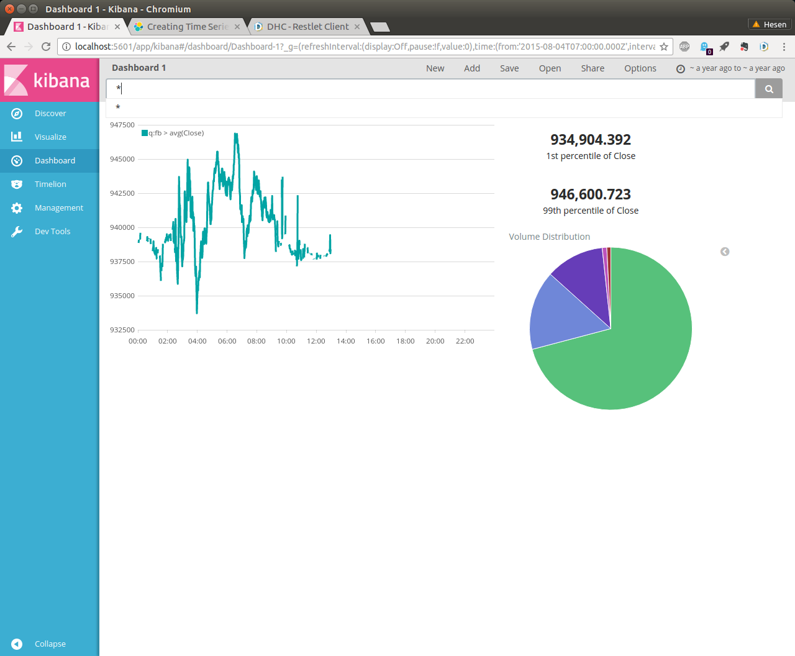

# 利用Elasticsearch, LogStash, Kibana集群实现数据可视化

本章节我们将会学习Elasticsearch和Kibana的基本用法，并且利用Kibana实现数
据可视化。

## 下载本章实例程序

下载本章实例程序和数据，只需执行下面操作：

``shell
git clone https://github.com/real-time-machine-learning/5-elasticsearch-logstash-kibana
``

## 启动Elasticsearch Kibana集群

只需执行下面命令

``shell
docker-compose up 
``

运行完成之后即可在`http://localhost:5601`访问到Kibana界面。本章节操作完
成后，我们可以得到一个实时股票监测界面，类似下图：

## 可能遇到的问题

本案例使用了Elasticsearch 5.0 的Docker镜像，在有些电脑上（如笔者的
Ubuntu笔记本电脑）， 需要对系统环境变量进行少许调整，才能正常运行。需要
运行以下命令
``shell
sudo sysctl -w vm.max_map_count=262144 
``

--- 
《实时机器学习实战》 彭河森、汪涵